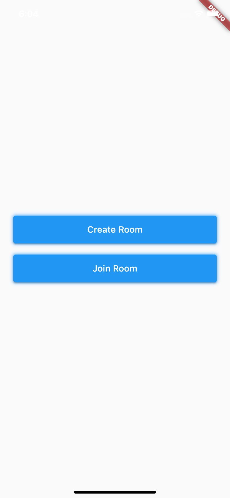
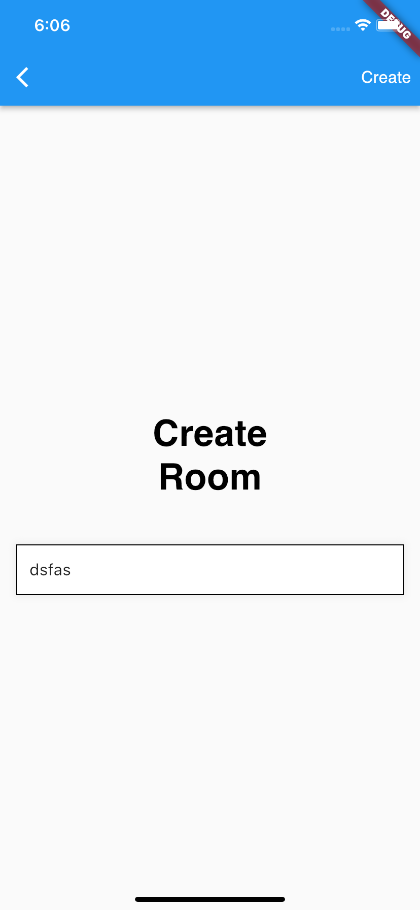
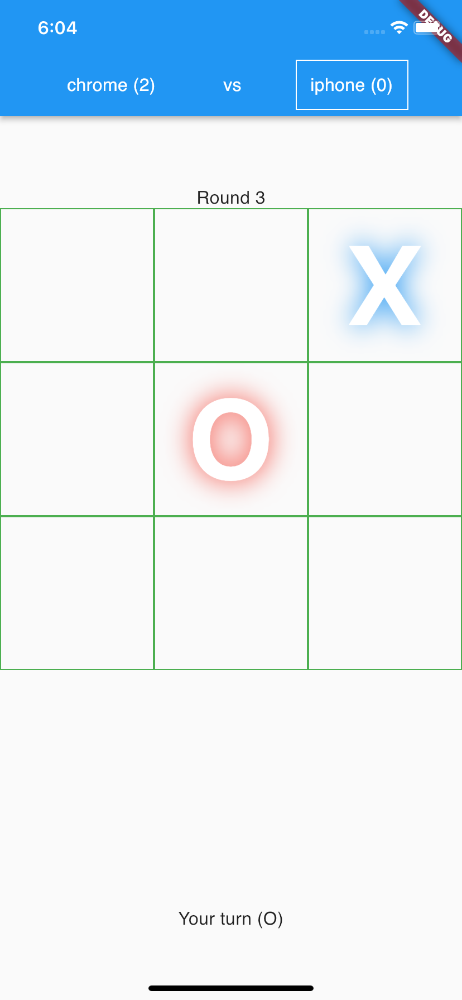

# TicTacToe Game

A Multiplayer TicTacToe Game- Works on Android, iOS and Web. 

## Features
- Create/Join Room
- Play Realtime
- Display Points
- Round & Game Winner
- Cross Platform Game

## Tech Used
**Server**: Node.js, Express, Socket_io, Mongoose, MongoDB

**Client**: Flutter, Riverpod, Socket client

## Feedback

If you have any feedback, please reach out to me at ghimireutsav11@gmail.com or 
https://utsavghimire.com.np

Inspired from the provider version of this app which can be found [here.](https://github.dev/RivaanRanawat/flutter-multiplayer-tictactoe)

## Screenshots

